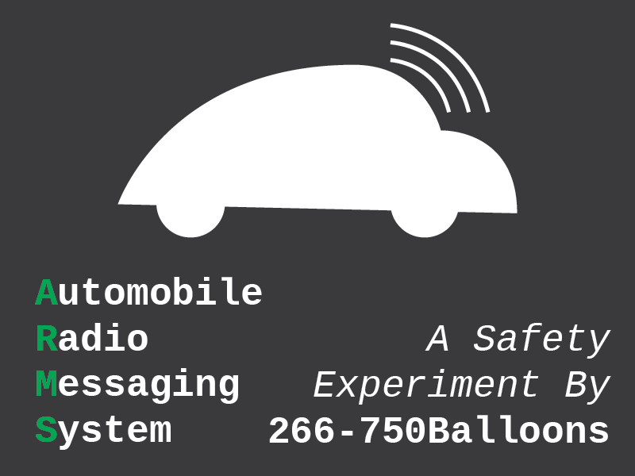

# arms-prototype
Prototype Implementation of Automobile Radio Messaging System transmitter, a safety system made by me, for US Congressional App Challenge 2021.



## To Try it Out (Raspberry Pi OS)
1. Install rpitx (see [here](https://github.com/F5OEO/rpitx#Installation)
2. Go into the rpitx directory and make a symlink to the pocsag command in /usr/bin
    ```bash
    sudo ln pocsag /usr/bin/pocsag
    ```
3. Install PyQt5 library
    ```bash
    #Much more reliable than installing it with pip
    sudo apt install python3-pyqt5
    ```
4. Clone project from Repo
    ```bash
    git clone https://github.com/266-750Balloons/arms-prototype
    ```
5. Go into directory.
    ```bash
    cd arms-prototype
    ```
6. Run ARMS frontend
    ```bash
    python3 armsUI.py
    ```
7. Tune into 160 Mhz (or go into the code and change it to your preffered) with your POCSAG receiver and start sending messages.

## How it works
I have a script, radioSend.py, that parses my codepoints for this system in the JSON file codePoints.py. armsUI.py inputs the words into radioSend.py, and each word of the message is turned into JSON objects with a unique MD5 hash to identity each message and a number representing a word. Each object is put into the rpitx pocsag command. Each word is transmitted twice on 434 MHz. 

## Credits
* [rpitx](https://github.com/F5OEO/rpitx): POCSAG transmitter program that my scripts use
* [Qt UI Framework](https://www.qt.io/): UI framework I used.
* Just about every internet forumn you can name, for helping me diagnose issues and learning certain tricks.

## License
Because the US Congress's App Challenge wants special rights to use your submission's source code for whatever it wants anyway, I just put it under the [MIT License](https://github.com/266-750Balloons/arms-prototype/blob/main/LICENSE).
